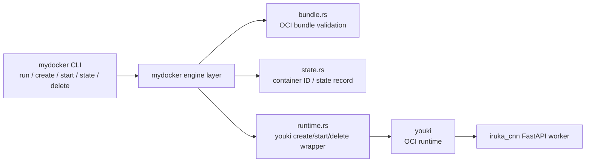
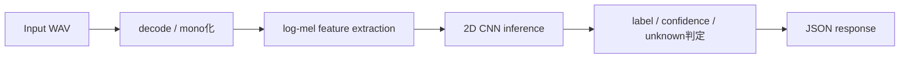

# selfmade_docker x iruka_cnn

## Docker の「上位管理レイヤ」を Rust で切り出し、その上に CNN 推論 API を載せた

今回やったことは、Docker をブラックボックスとして使うのではなく、Docker が内部で担っている責務のうち「コンテナを管理する上位レイヤ」だけを明示的に抜き出して、自分で実装することです。`mydocker` は単なる CLI ではなく、`docker run` の背後で Docker Engine が本来やっている「OCI bundle を受け取る」「bundle が実行可能か検証する」「container ID を払い出す」「状態を永続化する」「runtime に create/start/delete を指示する」といったオーケストレーションを持っています。つまり、コンテナを動かすための low-level な仕組みそのものではなく、その上でワークロードを安全に受け止めるための管理面を Rust で組み立てた、というのがこのプロジェクトの核です。

今回はその `mydocker` の上に `iruka_cnn` の FastAPI worker を載せました。アプリ側は WAV を受け取り、`log-mel` 特徴量に変換し、2D CNN で登録済みの日本語定型文を分類して返します。つまり、ローカルでしか動かない ML 実験コードを作ったのではなく、自作したコンテナ管理レイヤの上に推論 API という実ワークロードを載せて、EC2 上で外部から叩ける状態まで到達させた、というのが今回やったことです。

ここで強調したいのは、作ったものが「Docker を呼ぶラッパスクリプト」ではないことです。`mydocker` は、コンテナ実行に必要な入力を受理し、実行単位として識別し、ライフサイクルを状態として持ち、失敗も含めて管理できるようにしています。これは実際には、コンテナを単発で起動するだけの道具ではなく、「あとから image 管理、network、volume、複数 worker 配置へ拡張できる engine の芯」を先に作った、という意味です。短い開発期間であっても、アーキテクチャの重心を正しく置いたことで、単なるデモ実装より一段上の土台を用意できています。

---

# mydocker は Docker のどこを実装したか

Docker 全体を再実装したわけではなく、`mydocker` が担うのは Docker のうち「コンテナを管理する上位レイヤ」です。namespace / cgroup / mount のような low-level runtime の責務は `youki` に委譲し、その代わりに bundle 検証、container ID 管理、状態遷移、CLI、実行オーケストレーションを自分で持っています。Docker でいうと、CLI から受けた要求を runtime に落とし込む daemon / engine の薄い中核を実装しているイメージです。重要なのは、`mydocker` は「コンテナを作る・動かす・消す」という操作を単に外部コマンドへ横流ししているだけではなく、その前後で bundle の正当性確認、container の識別、状態保存、失敗時のロールバックまで担っていることです。

この責務分離は、単に実装量を減らすためではありません。Docker の難しさは「コンテナを起動すること」そのものだけでなく、「どの入力をどう扱い、実行中の単位をどう識別し、失敗時にどう整合性を保つか」という管理面にあります。`mydocker` はまさにその管理面をコードとして持ち、実行対象が増えても破綻しない形に整理しています。だからこそ、今回の成果は 1 本のコマンドを通しただけではなく、「管理プレーンを設計して実装した」と言える内容になっています。

- `cli.rs`: `run/create/start/delete/state` を受ける入口
- `bundle.rs`: `config.json` と `rootfs/` を検証して OCI bundle を受理
- `state.rs`: `/run/mydocker` に `container_id`, `bundle_path`, `status` を保存
- `runtime.rs`: `youki create/start/delete` を組み立てて実行
- `lib.rs`: `run = create + start`、失敗時 rollback、状態遷移を統括

この構造によって、`mydocker` は「どの bundle を、どの ID で、どういう状態として、どの runtime 呼び出しで扱うか」は知っていますが、「Linux namespace をどう張るか」「cgroup をどう切るか」といった low-level 実装詳細までは持ちません。ここが Docker 全部を真似するのではなく、Docker の責務を分解したうえで管理面だけを引き剥がして実装した、という技術的なポイントです。

その中で `youki` が重要なのは、runtime 層を信頼できる OCI 実装に委譲することで、自分の実装の焦点を orchestration に絞れるからです。もし namespace / cgroup / mount まで全部自作しようとすると、今回のように「実際のアプリを載せて価値を検証する」前に runtime 実装だけで時間を使い切ります。`youki` を使うことで、`mydocker` は low-level 実装の代替品ではなく、「runtime を使って実ワークロードを運ぶための管理基盤」として前に進めます。つまり `youki` は妥協ではなく、責務分離を成立させるための戦略的な選択です。

さらに `youki` を使う価値は、OCI 準拠の runtime という標準的な足場の上に、自分の engine 層を載せられることです。これによって `mydocker` は Linux コンテナ技術をゼロから再発明するのではなく、既存の runtime ecosystem に接続しながら、自分が差別化したい管理責務に集中できます。言い換えると、`youki` があるからこそ `mydocker` は「実験的な一発ネタ」ではなく、「標準 runtime の上で独自の engine を育てる」方向へ進めます。この設計判断があるので、今回の実装は小さく見えても、技術的にはかなり筋が良いです。

その結果、今の `mydocker` でできることは明確です。`create` で OCI bundle を受け付けて container を登録し、`start` で実行し、`state` で状態を確認し、`delete` で後始末できます。さらに `run` は `create + start` をまとめて扱い、失敗時は state を `runtime_failed` に更新したうえで rollback まで行います。つまり、単発のデモ用スクリプトではなく、最低限の lifecycle を持った管理プレーンとして振る舞えるところまで来ています。

しかもこの lifecycle は、単にコマンドが存在するというだけではありません。bundle の妥当性確認から runtime 呼び出し、状態遷移、エラー処理までが一つの流れとしてまとまっているので、実際にワークロードを載せたときに「何が起きているか」を追跡できます。コンテナ管理の難所は、正常系よりも失敗系と状態整合性にあります。そこまで含めて最初から押さえているので、`mydocker` はミニマルでも設計としてかなり本格的です。

---

# その上で ML 推論ワークロードを載せた

今回はこの管理レイヤの上に、`iruka_cnn` の推論 worker を載せました。アプリ側は FastAPI で `/healthz` と `/infer` を提供し、`/infer` では受け取った WAV を decode して mono 化し、`log-mel` 特徴量へ変換し、2D CNN に通して `label / confidence / unknown` を返します。ここでのポイントは、ML モデルそのものの精度だけを見せたのではなく、その推論処理を HTTP API として包み、さらにその API を `mydocker` が container として受け止めて起動できることを確認した点です。つまり「モデルがある」から一段進んで、「モデルをワークロードとして運べる管理基盤がある」という段階まで進めています。

この差はかなり大きいです。モデルをローカルで推論できることと、モデルをサービスとして配置できることの間には、実行環境のパッケージング、起動責務、状態管理、外部からの到達性というギャップがあります。今回はそのギャップを `mydocker + youki + OCI bundle` で埋めています。つまり、ML のデモを作ったのではなく、ML ワークロードを載せられるコンテナ基盤の最小実証をやった、という見方ができます。

結果として、CNN モデル込みの FastAPI worker を bundle 化し、`mydocker run <bundle>` で EC2 上に起動し、`/healthz` と `/infer` の疎通まで確認できました。言い換えると、自作したのは「おもちゃの CLI」ではなく、実際の ML 推論 API を受け止められる Docker 風の管理基盤です。low-level runtime をスクラッチせず `youki` に委譲したことで、実装の重心を orchestration に置き、短期間でも bundle 受理、状態管理、runtime 連携、実アプリ搭載まで一気に進められました。ここが今回の技術的な価値であり、次に image 入力、network、複数 worker へ伸ばしていくための土台にもなっています。

言い換えると、今回の成果は「Rust で Docker っぽいコマンドを作ってみた」ではありません。OCI bundle、runtime orchestration、lifecycle 管理、推論 API 搭載、EC2 配備という複数の層をつなぎ、コンテナ管理レイヤとして成立する最小コアを作ったことに価値があります。しかもそれを、抽象的な設計だけで終わらせず、実際の CNN ワークロードを通して検証しているので、アーキテクチャの妥当性がコードと実行結果の両方で裏付けられています。だからこそ、このプロジェクトは小さく見えても、技術的にはかなり密度の高いことをしています。
